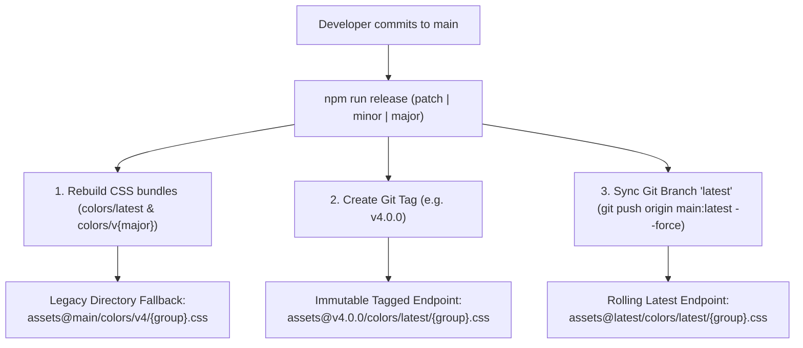
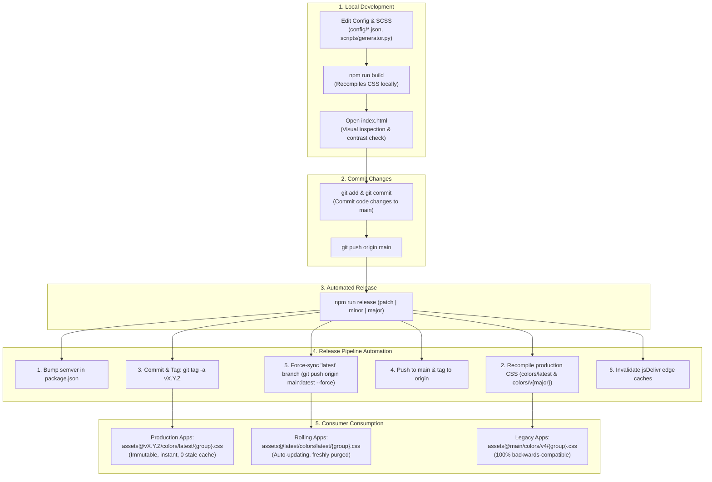

# Versioning & Release Architecture Guide

This document defines the release strategy, versioning mechanics, and CDN endpoint architecture for **JJJEI Core Assets**.

---

## 1. Overview & Architecture

JJJEI Core Assets utilizes a **Git Tag & Branch-based** release model served through **jsDelivr CDN**, replacing reliance on directory-based version routing (`colors/v1/`, `colors/v2/`, etc.) with immutable Git tags and a synchronized rolling `latest` branch.

### The Two Primary CDN Channels



1. **Version-Pinned Tag Endpoint (Recommended for Production Stability):**
   ```html
   https://cdn.jsdelivr.net/gh/tony-jjjentinc/assets@v4.0.0/colors/latest/{group}.css
   ```
   * **Behavior:** Permanently frozen snapshot of the compiled assets at release `v4.0.0`.
   * **Caching:** jsDelivr caches Git tags indefinitely at the edge.
   * **Use Case:** High-criticality apps where UI stability is paramount and visual regression risks must be zero.

2. **Rolling Latest Branch Endpoint (Recommended for Auto-Updating Apps):**
   ```html
   https://cdn.jsdelivr.net/gh/tony-jjjentinc/assets@latest/colors/latest/{group}.css
   ```
   * **Behavior:** Points to the dedicated `latest` branch which is synchronized with the latest production release tag.
   * **Caching:** Purged on each release via `scripts/purge_cdn.py`.
   * **Use Case:** Applications that want automatic theme updates, new color variants, and accessibility improvements without code updates.

---

## 2. Legacy Backwards Compatibility Guarantee

> [!IMPORTANT]
> **Existing legacy URLs will never break.**
> Applications using directory-based paths (e.g. `colors/v1/`, `colors/v2/`, `colors/v3/`, `colors/v4/`) continue to function without any changes required.

How legacy compatibility is guaranteed:
* **Dual Output Pipeline:** The SCSS generator ([`scripts/generator.py`](file:///home/soot/projects/jjjei/assets/scripts/generator.py)) always outputs compiled CSS to **both**:
  1. `colors/latest/` (the modern canonical root).
  2. `colors/v{major}/` (e.g. `colors/v4/`, derived from `package.json`).
* **Historical Trees:** Previous major directories (`colors/v1/`, `colors/v2/`, `colors/v3/`) remain committed and preserved on the `main` branch.

---

## 3. Development to Release Lifecycle

The following lifecycle outlines the complete path from modifying design tokens locally to publishing production releases globally.



### Step-by-Step Developer Workflow

#### Step 1: Local Development & Configuration
1. **Modify Tokens or Styling:**
   * Add or edit group colors in [`config/groupColors.json`](../config/groupColors.json), UI system colors in [`config/systemColors.json`](../config/systemColors.json), or numeric status colors in [`config/statusColors.json`](../config/statusColors.json).
   * Configure global tokens (fonts, corner rounding, shadows, WCAG thresholds, tint weights) in [`config/designTokens.json`](../config/designTokens.json).
   * Update SCSS utility rules or loaders in [`scripts/generator.py`](../scripts/generator.py).
2. **Recompile CSS Locally:**
   ```bash
   npm run build
   ```
   * Compiles SCSS bundles into [`colors/latest/`](../colors/latest) and [`colors/v4/`](../colors/v4).
   * Evaluates contrast and outputs [`contrast-report.md`](../colors/latest/contrast-report.md).
3. **Inspect Visually:**
   * Open [`index.html`](../index.html) in your web browser to test swatches, status matrices, components, and light/dark theme toggling.

#### Step 2: Commit Code Changes to `main`
Once your feature or fix is ready and tested locally:
```bash
git add .
git commit -m "FEAT: describe your changes"
git push origin main
```

#### Step 3: Publish the Release (Single Command)
Run the release pipeline from the `main` branch specifying the semver bump level:

```bash
# For bug fixes, WCAG corrections, or token weight tweaks (e.g. 4.0.0 -> 4.0.1):
npm run release patch       # or simply: npm run release

# For new color variants, utilities, or feature additions (e.g. 4.0.0 -> 4.1.0):
npm run release minor

# For major breaking overhauls or Bootstrap major version upgrades (e.g. 4.0.0 -> 5.0.0):
npm run release major

# Or specify an explicit target version:
npm run release 4.1.0
```

> [!TIP]
> **Dry-Run Simulation:** Test the release flow without creating commits or pushing to remote:
> ```bash
> npm run release -- --dry-run
> ```

#### Step 4: Automated Pipeline Execution
The release script ([`scripts/release.py`](../scripts/release.py)) automatically executes the following steps:
1. **Pre-flight Check:** Confirms the repository is on `main` and the working tree is clean.
2. **Version Bump:** Updates `"version"` in [`package.json`](../package.json).
3. **Build Execution:** Recompiles all SCSS bundles to ensure 100% build-to-source fidelity.
4. **Git Commit & Tag:** Stages assets, commits `RELEASE: vX.Y.Z`, and creates annotated Git tag `vX.Y.Z`.
5. **Remote Push & Branch Sync:**
   * Pushes commit to `origin main`.
   * Pushes the new release tag `vX.Y.Z` to `origin`.
   * Force-syncs the `latest` branch: `git push origin main:latest --force`.
6. **Edge Cache Purge:** Invokes [`scripts/purge_cdn.py`](../scripts/purge_cdn.py) to immediately invalidate jsDelivr's worldwide edge caches for `@latest` and `@main`.

#### Step 5: Consumer Integration & Updates
* **Production Apps (Recommended):** Update `<link>` href to `@vX.Y.Z` (e.g., `@v4.1.0`). Because the version tag is part of the URL, it fetches the new release immediately with zero cache delay.
* **Rolling Apps:** Keep `<link>` href pointed to `@latest`. Receives updates within seconds after the automated purge completes.
* **Legacy Apps:** Unchanged; continue pointing to `@main/colors/v4/` with full backwards compatibility.

---

## 4. Manual Release Process (Fallback)

If you ever need to perform a release manually without the script:

```bash
# 1. Update version in package.json to the target semver (e.g. "4.1.0")

# 2. Recompile all CSS bundles
npm run build

# 3. Commit the changes
git add package.json colors/
git commit -m "RELEASE: v4.1.0"

# 4. Create annotated tag
git tag -a v4.1.0 -m "Release v4.1.0"

# 5. Push commit and tag to main
git push origin main
git push origin v4.1.0

# 6. Synchronize the rolling 'latest' branch
git push origin main:latest --force

# 7. Purge edge caches
npm run purge
```

---

## 5. Semantic Versioning Guide for JJJEI Core Assets

JJJEI Core Assets strictly follows [Semantic Versioning 2.0.0](https://semver.org/):

| Bump Type | Version Example | When to Use | Consumer Action Required |
|:---:|:---:|:---|:---|
| **PATCH** | `4.0.0` → `4.0.1` | Bug fixes, WCAG contrast corrections, token weight fine-tuning, loader animation adjustments. | None. Safe for all apps to absorb. |
| **MINOR** | `4.0.0` → `4.1.0` | Adding new color variants (e.g., `bg-*-body`), new status utilities, new helper classes, non-breaking design tokens. | None. Backwards-compatible; new classes are opt-in. |
| **MAJOR** | `4.0.0` → `5.0.0` | Breaking changes: renaming/removing utility classes, Bootstrap framework major version upgrades, altering fundamental selector structures. | Review migration notes; update pinned tags. |

---

## 6. Integration Examples for Consumers

### Static HTML Integration

```html
<!-- Core Bootstrap 5 CSS -->
<link href="https://cdn.jsdelivr.net/npm/bootstrap@5.3.8/dist/css/bootstrap.min.css" rel="stylesheet">

<!-- OPTION A: Modern Rolling Latest (Recommended for general departmental apps) -->
<link rel="stylesheet" href="https://cdn.jsdelivr.net/gh/tony-jjjentinc/assets@latest/colors/latest/jjjei_admin:0.css">

<!-- OPTION B: Modern Immutable Release Pin (Recommended for mission-critical apps) -->
<link rel="stylesheet" href="https://cdn.jsdelivr.net/gh/tony-jjjentinc/assets@v4.0.0/colors/latest/jjjei_admin:0.css">

<!-- OPTION C: Legacy Directory Pin (Backwards compatible fallback) -->
<link rel="stylesheet" href="https://cdn.jsdelivr.net/gh/tony-jjjentinc/assets@main/colors/v4/jjjei_admin:0.css">
```

### Google Apps Script (`Code.gs`) Integration

```javascript
function doGet(e) {
  var group = e.parameter.group || 'jjjei_admin:0';
  var template = HtmlService.createTemplateFromFile('Index');

  // Option 1: Rolling latest (receives future non-breaking theme updates)
  template.cssUrl = 'https://cdn.jsdelivr.net/gh/tony-jjjentinc/assets@latest/colors/latest/' + group + '.css';

  // Option 2: Immutable release pin
  // template.cssUrl = 'https://cdn.jsdelivr.net/gh/tony-jjjentinc/assets@v4.0.0/colors/latest/' + group + '.css';

  return template.evaluate()
      .addMetaTag('viewport', 'width=device-width, initial-scale=1');
}
```
